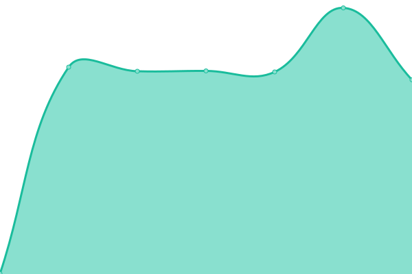
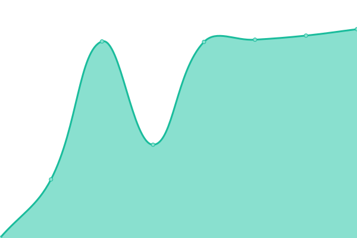

# [📈 Live Status](https://demo.upptime.js.org): <!--live status--> **🟩 All systems operational**

This repository contains the open-source uptime monitor and status page for [markusbaumg](https://demo.upptime.js.org), powered by [Upptime](https://github.com/upptime/upptime).

With [Upptime](https://upptime.js.org), you can get your own unlimited and free uptime monitor and status page, powered entirely by a GitHub repository. We use [Issues](https://github.com/markusbaumg/status/issues) as incident reports, [Actions](https://github.com/markusbaumg/status/actions) as uptime monitors, and [Pages](https://demo.upptime.js.org) for the status page.

<!--start: status pages-->
<!-- This summary is generated by Upptime (https://github.com/upptime/upptime) -->
<!-- Do not edit this manually, your changes will be overwritten -->
<!-- prettier-ignore -->
| URL | Status | History | Response Time | Uptime |
| --- | ------ | ------- | ------------- | ------ |
|  [legal-i App](https://app.legal-i.ch) | 🟩 Up | [legal-i-app.yml](https://github.com/legal-i/status/commits/HEAD/history/legal-i-app.yml) | 

 819ms
     
 | 

<a href="https://status.legal-i.ch/history/legal-i-app">100.00%</a>
    

|  [legal-i API](https://api.legal-i.ch/api/v1/short-commit-id) | 🟩 Up | [legal-i-api.yml](https://github.com/legal-i/status/commits/HEAD/history/legal-i-api.yml) | 

 654ms
     
 | 

<a href="https://status.legal-i.ch/history/legal-i-api">100.00%</a>
    

|  [legal-i Agents API](https://agents.legal-i.ch/api/v1/short-commit-id) | 🟩 Up | [legal-i-agents-api.yml](https://github.com/legal-i/status/commits/HEAD/history/legal-i-agents-api.yml) | 

 628ms
     
 | 

<a href="https://status.legal-i.ch/history/legal-i-agents-api">100.00%</a>
    

|  [legal-i Website](https://www.legal-i.ch) | 🟩 Up | [legal-i-website.yml](https://github.com/legal-i/status/commits/HEAD/history/legal-i-website.yml) | 

 171ms
     
 | 

<a href="https://status.legal-i.ch/history/legal-i-website">100.00%</a>
    

<!--end: status pages-->

[**Visit our status website →**](https://demo.upptime.js.org)

## 📄 License

- Powered by: [Upptime](https://github.com/upptime/upptime)
- Code: [MIT](./LICENSE) © [markusbaumg](https://demo.upptime.js.org)
- Data in the `./history` directory: [Open Database License](https://opendatacommons.org/licenses/odbl/1-0/)
